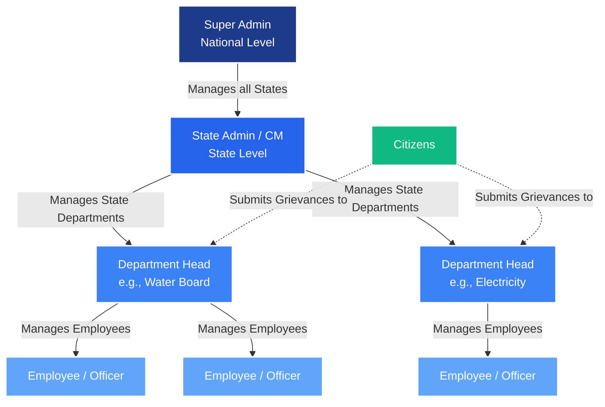
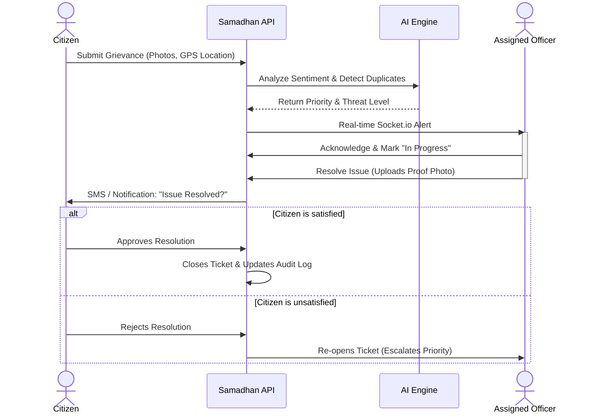
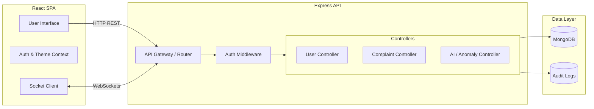

<div align="center">
  <h1>🏛️ Samadhan</h1>
  <p><strong>National Public Grievance Redressal & Workforce Management System</strong></p>
</div>

<br />

**Samadhan** is a highly scalable, secure, and hierarchical platform designed to bridge the gap between citizens and government officials. It facilitates the end-to-end lifecycle of public grievances, from geospatial reporting to AI-assisted resolution, while providing powerful oversight tools for State Chief Ministers (CM) and National Super Admins.

---

## 📑 Table of Contents
1. [Core Architecture & Technologies](#-core-architecture--technologies)
2. [Hierarchical RBAC Architecture](#-hierarchical-rbac-architecture)
3. [Grievance Redressal Process Flow](#-grievance-redressal-process-flow)
4. [System Flowchart & Microservices](#-system-flowchart--microservices)
5. [Key Features](#-key-features)
6. [Security & Data Integrity](#-security--data-integrity)
7. [Installation & Local Setup](#-installation--local-setup)

---

## 🛠 Core Architecture & Technologies

Samadhan is built on a robust MERN stack, enhanced with real-time bidirectional communication and geospatial data processing.

- **Frontend:** React 18, React Router DOM, Lucide Icons, Leaflet (Geospatial Mapping), Socket.io-client.
- **Backend:** Node.js, Express.js.
- **Database:** MongoDB & Mongoose (utilizing `2dsphere` indexes for geographic coordinate querying).
- **Real-Time Engine:** Socket.io (for instant grievance alerts and status updates).
- **Authentication & Security:** JWT (JSON Web Tokens), bcrypt (Password Hashing), express-rate-limit.

---

## 👑 Hierarchical RBAC Architecture

Samadhan enforces strict data-partitioning and mutation boundaries based on 5 primary roles. The hierarchy ensures that lower-level employees only see what they need to, while higher-level admins have appropriate oversight without overwhelming their dashboards.



**Visibility Rules:**
- **Department Heads** can *only* manage Employees within their specific department.
- **State Admins (CM)** can *only* oversee Departments, Employees, and Citizens within their registered state.
- **Super Admins** have a macro-view of the entire nation but are protected from micro-level department pollution.

---

## 🔄 Grievance Redressal Process Flow

The lifecycle of a complaint guarantees accountability. An officer cannot simply close a ticket—the citizen must verify that the real-world issue was actually resolved.



---

## ⚙️ System Flowchart & Microservices

The application is structured logically to separate concerns between routing, authentication, and core business logic.



---

## ✨ Key Features

### 📍 Geospatial Mapping & Heatmaps
Citizens can drop a pin on a live Leaflet map to report issues. The backend utilizes MongoDB's `$near` and `$geoWithin` operators to build live heatmaps for State Admins, helping them identify infrastructure failure clusters (e.g., flooded roads during monsoons).

### 🧠 AI-Powered Insights
The system actively monitors the database to detect operational bottlenecks. 
- **Public Sentiment Tracking**: Aggregates complaint tone to gauge public anger/satisfaction.
- **Officer Performance Anomalies**: Flags officers who are closing complex tickets suspiciously fast (potential fraud) or leaving critical tickets unassigned for too long.

### 🔔 Socket.io Real-Time Event Bus
Polling is eliminated. When a citizen submits a critical infrastructure failure (e.g., live wire down), the assigned department's officers receive a real-time toast notification instantly.

---

## 🔒 Security & Data Integrity

Given the sensitive nature of government data, Samadhan employs strict architectural guardrails:

1. **Secure Action Verification**: 
   Standard JWT authentication is not enough for destructive actions. If an Admin attempts to Edit or Delete a user/department, the system triggers a secure challenge requiring:
   - Re-entry of the administrator's password.
   - A mandatory justification text (min 10 characters).
2. **Immutable Audit Logging**: 
   Every verified action creates an immutable record in the `AuditLog` collection, mapping the exact `req.user._id`, the `entity` modified, the geographic `state`, and the justification provided.
3. **Strict Route Partitioning**: 
   Backend controllers actively intercept cross-state API requests. If a Maharashtra State Admin attempts to query Gujarat's department data, the API intercepts and rejects the request natively at the controller level.

---

## 🚀 Installation & Local Setup

### 1. Prerequisites
- **Node.js** (v16.x or higher)
- **MongoDB** (Local instance running on `localhost:27017` or a MongoDB Atlas URI)

### 2. Backend Setup
Navigate to the backend directory, install dependencies, and configure environment variables.
```bash
cd backend
npm install

# Create environment configuration
echo "PORT=5000" > .env
echo "NODE_ENV=development" >> .env
echo "MONGO_URI=mongodb://localhost:27017/samadhan" >> .env
echo "JWT_SECRET=your_super_secret_jwt_key" >> .env
echo "JWT_EXPIRE=30d" >> .env

# Start the Express server
npm run dev
```

### 3. Frontend Setup
Open a new terminal, navigate to the frontend directory, install dependencies, and start the React app.
```bash
cd frontend
npm install

# Start the React development server
npm start
```
The application will spin up at `http://localhost:3000`.

---
<div align="center">
  <i>Built to modernize and secure public grievance redressal infrastructure.</i>
</div>
